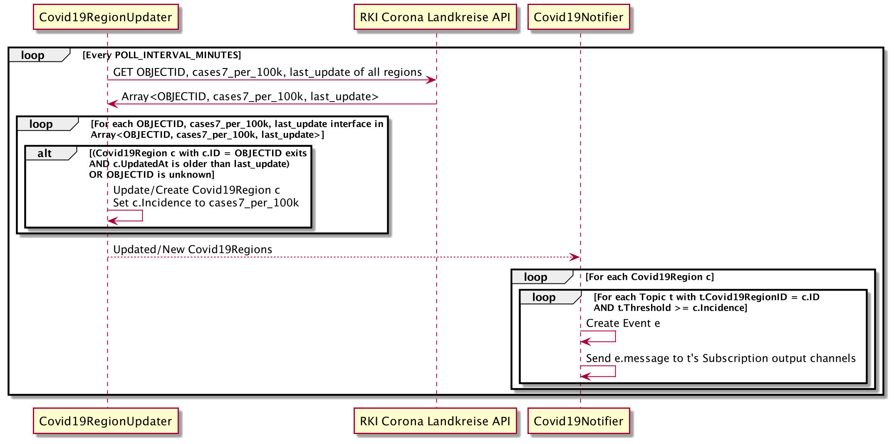

<h1>COVID-19 Update Service Documentation</h1>


- [1. Idea](#1-idea)
- [2. Team](#2-team)
- [3. Realization](#3-realization)
  - [3.1. COVID-19 Update Service](#31-covid-19-update-service)
    - [3.1.1. API](#311-api)
    - [3.1.2. Implementation](#312-implementation)
    - [3.1.3. Testing](#313-testing)
    - [3.1.4. Known Limitations](#314-known-limitations)
  - [3.2. Telegram Notification Service](#32-telegram-notification-service)
    - [3.2.1. API](#321-api)
    - [3.2.2. Application Insights](#322-application-insights)
    - [3.2.3. Authorization](#323-authorization)
    - [3.2.4. Testing](#324-testing)
    - [3.2.5. Known Limitations](#325-known-limitations)
  - [3.3. Client (Dashboard Service)](#33-client-dashboard-service)
    - [3.3.1. Usage of Client](#331-usage-of-client)
- [4. Deployment](#4-deployment)
- [5. Appendix](#5-appendix)
  - [5.1. COVID-19 Update Service](#51-covid-19-update-service)
    - [5.1.1. OpenAPI Description](#511-openapi-description)
    - [5.1.2. Class Diagram](#512-class-diagram)
  - [5.2. Telegram Notification Service](#52-telegram-notification-service)
    - [5.2.1. OpenAPI Description](#521-openapi-description)

# 1. Idea

The aim of the COVID-19 Update Service is to inform a user about the current COVID-19 7-day incidence for, by the user selected, locations within Germany. Therefore the user should be able to select multiple locations, that are then monitored by the service. For each location the user should be able to set a threshold for the incidence value. Whenever the COVID-19 7-day incidence value for a region exceeds the threshold, the user should be notified. Besides from providing the notifications through the service's API, the notifications should be also shipped via email and/or Telegram. 

# 2. Team

The team consists of Tony Fiedler, Yoaxin Jing and Ludwig Maximilian Leibl.
Thereby Yoaxin implemented the client (Dashboard Service). Maximilian was responsible for the design of the general service architecture and the implementation of the COVID-19 Update Service. Tony was responsible for the implementation of the Telegram Notification Service and the deployment of all components in the cloud. 

# 3. Realization


Besides the COVID-19 Update Service itself, we also have developed a Telegram Notification Service, which handles the communication with the Telegram API. As client a web application (dashboard) has been developed.

The following sections provide insigths into the single components.

## 3.1. COVID-19 Update Service 

The COVID-19 Update Service offers the user to select the locations for which the COVID-19 7-day-incidence should be monitored and the output channels he/she wants through which to receive notifications.
As background process the service monitors the COVID-19 7-day-incidence values for the selected locations. Whenever the user-defined threshold for a location is exceeded, the COVID-19 Update Service generates an event and ships it to the user's output channels.

### 3.1.1. API

The COVID-19 Update Service offers a REST API, whose [OpenAPI](#covid19-open-api) interface description is available via [Swagger UI](https://185.128.119.135/swagger/).

> **Please Note**: Since Swagger UI currently does not support the OAuth client credentials flow with [Auth0](https://auth0.com), you have to manually insert a valid Bearer token. To obtain the JWT access token, please follow the instructions described [here](#3112-authorization).

#### 3.1.1.1. Resources

In order to implement the HATEOAS aspect of REST services for the COVID-19 Update Service, the [JSON Hypertext Applicaiton Language](https://tools.ietf.org/html/draft-kelly-json-hal-08) (HAL) is used as representation format of the service's resources.
For requests the API accepts simple JSON.


 
As shown in the resource overview, the COVID-19 Update Service's API is built based on the `Subscription` resource. A `Subscription` represents the notification output channels for updates on the COVID19 7-day-incidence values. For email notifications the user has to provide his/her email address. In order to receive notifications via Telegram the user has to provide the chat ID, which is provided by the Telegram chat bot (see [Telegram Notification Serivce](#32-telegram-notification-service)). If the user does not want to receive notifications through these outputs, he/she can simply omit the attributes while creating a new `Subscription` resource or set them `null`.

Once a `Subscription` is created, the user can start to create `Topics` as sub-resources of a `Subscription`. A `Topic` represents a location the user wants to be monitored by the COVID-19 Update Service. The location (`Position`) is definied as `GPS Position`. Additionally the `Topics` contains the threshold value above which a notification should be sent to the output channels specified in the corresponding `Subscription`.

Whenever the threshold is exceeded, the COVID-19 Update Service creates an `Event` as sub-resource of the `Topic`. The `Event` represents the message which is sent via the output channels. Additionally the `Events` can be requested by the user through the service's API.

In order to retreive the current COVID-19 7-day-incidence value for a location, each `Topic` has an `Incidence` sub-resource, which represents the latest incidence.

#### 3.1.1.2. Authorization

In order to use the COVID-19 Update Service, the client has to be authorized via OAuth 2.0. The JWT access token has to be provided during the communication with the COVID-19 Update Service as Bearer token inside the `Authorization` header.
[Auth0](https://auth0.com) is used as external authorization server. RS256 is chosen as signing algorithm.

To provide multi-tenant support, a `Subscription` is always created in context of the resource owner, who is identified by the `sub` claim in the Auth0's JWT access token. A client with a valid JWT token but a different `sub` claim is not authorized to access a `Subscription` or associated sub-resources of another resource owner.

In our show case we decided to make the client itself the resource owner. It uses its own user management to internally scope a `Subscription` to an end-user.
Therefore the client uses the client credentials grant to receive an access token for the COVID-19 Update Service. Below is an example request in order to receive a token:

```zsh
curl --request POST \
  --url https://scc2020g8.eu.auth0.com/oauth/token \
  --header 'content-type: application/json' \
  --data '{"client_id":"IxqpXc0tF2YRBTquqaPTZbf2bbGLRKo8","client_secret":"loSiW2ZQrjCriV9Vfiyh2yt4HyyGyKmjIDCqZyiDLX82jeeMd7bOfm2EHtTPcROf","audience":"https://185.128.119.135","grant_type":"client_credentials"}'
```

Thereby `audience` is Auth0's identifier of the API that is being called for an access token.

### 3.1.2. Implementation

The COVID-19 Update Service is written in Go using the [Gorilla Web Toolkit](https://www.gorillatoolkit.org) for internal request routing. A SQLite database is used as persistent storage. For database abstraction [GORM](https://gorm.io) is used.

The current COVID-19 incidence values are provided by the [RKI Corona Landkreise REST API](https://npgeo-corona-npgeo-de.hub.arcgis.com/datasets/917fc37a709542548cc3be077a786c17_0/geoservice?geometry=-23.356%2C23.867%2C42.562%2C64.915), which is available on the *Nationale Plattform für geographische Daten* (NPGEO). 

In order to send an email when an `Event` is created, the SendGrid Email Delivery Service via the [SendGrid Web API v3](https://sendgrid.com/docs/api-reference/) is used. Telegram notifications are sent using the self-written [Telegram Notification Service](#32-telegram-notification-service).

The [class diagram](#512-class-diagram) provides a simplified overview of the COVID-19 Update Service's internal structure. The service is split in 4 go modules: `server`, `model` `rki` and `notifier`.

#### 3.1.2.1. `server` 


The `server` module includes the `Covid19UpdateWebServer`, which provides the handler functions of the service's REST interface. 

In order to validate the JWT access token, that has to be provided during the requests, the server uses the internal `authorizationHandler`. The token's signature is validated using the Auth0's authorization server's public key.
If the token is valid, the JWT's `sub` claim is extracted and stored in context of the request. Only `Subscriptions` whose `OwnerID` matches the claim's value can be accessed during a request. Requests to `Subscriptions` with a different `OwnerID`  are unauthorized. This access restriction applies also for the sub-resources (`Topic`, `Event`, `Incidence`) of a `Subscription`.


#### 3.1.2.2. `model`


The `model` module consists of the models/resources that are used whithin the service. Models that implement the `HALCompatibleModel` interface can be represented using the JSON Hypertext Application Language. The models that extend the `PersistentModel` can be persisted to the SQLite database.

The following table provides a brief overview of the models:

| Model  | Persistent | Description  | 
|---|---|---|
| `Subscription`  | x | The `Subscription` represents the notification output channels for updates on the COVID19 7-day-incidence values. It is the service's main resource. A `Subscription`  is always created in context of a `OwnerID` (access JWT's `sub` claim value of the create request). |   
|  `Topic` | x | A `Topic` is a sub-resource of a `Subscription`. It represents the location (`GPSPosition`) for which the COVID-19 7-day-incidence should be monitored and the threshold value above which a notification should be sent via the notification channels, that are defined in the corresponding `Subscription`.  |  
| `Event` |x |  An `Event` is a sub-resource of a `Topic`. Whenever the COVID-19 7-day-incidence value threshold of a `Topic`'s position is exceeded, an `Event` is created. The `Event` contains the message which is sent to the output channels, that are defined in the `Topic`'s associated `Subscription`.  |  
| `Covid19Region` | x |  The GPS position of a topic is internally linked to the region identifier used by the RKI (`Covid19RegionID`). For each region, for which COVID-19 7-day-incidence information is provided by the RKI, the COVID-19 Update Service holds a `Covid19Region` model, that associates the region identifier to the latest incidence value for this region. |
| `Incidence` |  |  An `Incidence` is a sub-resource of a `Topic`, that represents the current COVID-19 7-day incidence value for the `Topic`'s position. Internally the `Incidence` is just a non-persistent DTO for the service' REST API. |
| `Incidence` |  |  `ErrorT` is a non-persistent resource, that represents errors that occur while using the service's REST API. |

#### 3.1.2.3. `rki`


The `rki` module encapsulates the communication with the RKI Corona Landkreise REST API. The `Covid19RegionUpdater` periodically polls the current incidence values (`cases7_per_100k`), RKI region identifier (`OBJECTID`) and the time of update (`last_update`) of all regions, the RKI provides information for. Therefore the following `GET` request is used: [https://services7.arcgis.com/mOBPykOjAyBO2ZKk/arcgis/rest/services/RKI_Landkreisdaten/FeatureServer/0/query?where=1%3D1&outFields=OBJECTID,cases7_per_100k,last_update&returnGeometry=false&f=json](https://services7.arcgis.com/mOBPykOjAyBO2ZKk/arcgis/rest/services/RKI_Landkreisdaten/FeatureServer/0/query?where=1%3D1&outFields=OBJECTID,cases7_per_100k,last_update&returnGeometry=false&f=json) 

For each incidence returned by the RKI API, the `Covid19RegionUpdater` checks whether or not an update for the internally stored `Covid19Regions` is available. It therefore checks if the `Covid19Region` with  `ID` equal to `OBJECTID` is older than  `last_update`. It will then update the `Incidence` to `cases7_per_100k`. If `OBJECTID` is unknown, the `Covid19RegionUpdater` will create a new `Covid19Region`.

> New `Covid19Regions` should normally only be created on the first time the RKI API is requested after the COVID-19 Update Service starts with an empty SQLite database.

The updated and new `Covid19Regions` are sent to the buffered channel `c`, which later allows the `Covid19Notifier` of the `notifier` module to receive updates asynchronously.

When a `Topic` is created or updated, the RKI Corona Landkreise API is used to match the provided `GPSPosition` to a `OBJECTID` in order to link the `Topic` with the corresponding  `Covid19Region`.
 

#### 3.1.2.4. `notifier`


The `notifier` module contains the `Covid19Notifier`, which determines for every existing `Topic` whether or not an `Event` has to be created if the corresponding `Covid19Region` has updated and the current incidence value exceeds the configured threshold. The updates of the `Covid19Regions` are received asynchronously over the buffered channel `c` from the `Covid19Notifier` of the `rki` package.

The `Events` are sent via the output channels, that are defined in the `Topic`'s associated `Subscription`. The shipping is done via the `TelegramPublisher` and `EmailPublisher`, which encapsulate the communication with the Telegram Notification Service and the SendGrid Email Delivery Service.
For the `TelegramPublisher` the `Auth0AccessTokenHelper` encapsulates the handling and refreshing of the OAuth 2.0 access token via Auth0.

The following sequence diagram shows the interaction between the `Covid19Notifier` and the `Covid19RegionUpdater` of the `rki` module:



### 3.1.3. Testing

The REST API of the COVID-19 Update Service was E2E tested using the [Postman Collection Runner](https://learning.postman.com/docs/running-collections/intro-to-collection-runs/) to execute *Postman Test Collections*. During the tests the available CRUD operations for each resource were tested.
The test were performed both locally and at the Cloud'n'Heat deployment.

The used Postman test collection and the corresponding test environment are available at [Bitbucket](https://bitbucket.org/tudresden/ws2020-gruppe8/src/master/COVID-19-update-service/test/).

### 3.1.4. Known Limitations

- The `/subscriptions` and `/subscriptions/ID/topics` endpoints do not support a limit for the returned resources. For large number of `Subscriptions` or `Topics` this can be inconvenient.
- No [CURIEs](https://tools.ietf.org/html/draft-kelly-json-hal-08#section-8.2) are used within the HAL responses.
- Notifications are generated as soon as the RKI updates the COVID-19 incidence values. This is currently done on a daily basis. If the RKI starts to update the values several times a day in the future, this could disturb users. Future version of the COVID-19 Update Service should allow to configure the notification interval for `Subscriptions.`.
- The Telegram chat ID of a `Subscription` is not checked whether or not it is a valid identifier for the Telegram chat bot.

## 3.2. Telegram Notification Service

This web service is able to send messages via the messenger [Telegram](https://telegram.org/).

Telegram provides a [Bot API](https://core.telegram.org/bots/api) which is used to enable chatting with a regular Telegram user.

For being able to receive messages from a bot in Telegram a user has to start the initial communication by searching for the bot's username and entering the `/start` command into the chat.

Relevant API calls for sending messages are implemented by this service.

Persistence of `notification` objects is realized by using a SQLite database file.

### 3.2.1. API

A RESTful API is implemented which provides some endpoints and is responsible for managing `notification` resources.
It was designed to be used by a rather non-human client. Therefore, supported response content types are "plain" JSON and [JSON Hypertext Application Language](https://tools.ietf.org/html/draft-kelly-json-hal-08).

#### 3.2.1.1. Endpoints

Three endpoints are provided:

* `GET /notification` is used to list all `notification` resources. Optionally a query parameter `recipient` can be issued to filter `notifications` of a specific recipient.
* `POST /notification` is the endpoint for creating `notification` objects. Required parameters are `recipient` and the actual message (`msg`) to be sent. If no error happened, Telegram was able to deliver the message to the desired chat identified by `recipient`. 
* `GET /notification/{id}` lists exactly one `notification` object. It requires the specification of an existing `notification` by its `id`.

Please consult the [OpenAPI documentation deployed via Swagger](https://185.128.119.135/swagger/?urls.primaryName=Telegram%20Notification%20Service) to test it out and to get more information.
The complete API documentation is also provided in the [appendix](#521-openapi-description).

#### 3.2.1.2. Notification Resource

`notifications` basically represent the state of a message which should have been sent via the Telegram bot api to a corresponding user who stays in contact with the Telegram bot.

Attributes:

* id is the unique identifier of notifications.
* recipient represents a Telegram channel id.
* message (`msg`) specifies the actual text which has to be sent to the recipient.
* creation date (`creation_date`) defines the date and time of when a `notification` object was created (using UTC time zone). 
* error message (`error_msg`) maintains a very concrete state about success or failure of sending a message. The field `request_error` defines possible error messages which could happen on communicating with the Telegram bot api servers. `status_code` is the http status code of such a request. The last field is the [`telegram_response` resource](https://core.telegram.org/bots/api#making-requests) which contains the exact response of the Telegram api servers.
* human-readable error message (`error_msg_human_readable`) represents an error message if something went wrong in the process talking to the Telegram bot api servers. It has the nature that it contains some user-understandable error message. E.g., `chat not found` if the `recipient` field doesn't contain a valid Telegram channel identifier.

### 3.2.2. Application Insights

The web service is written in Python 3 by using the [Flask](https://flask.palletsprojects.com/en/1.1.x/) web framework.
In order to provide data persistence across application restarts the database toolkit [SQLAlchemy](https://docs.sqlalchemy.org/en/13/) was chosen.
The database model has exactly the same fields as the `notification` resource.


The class diagram shows the relation of used classes. Colored boxes indicate external Python packages.
The class `NotificationResource` is the center of attention. It glues everything together and is responsible for building the actual HTTP request data and orchestrates the flow of fetching or creating resources. The response content can be represented as either JSON or JSON HAL. This is decided by the content-types which are supported by the requesting HTTP client. If both JSON and JSON HAL are supported JSON HAL will be the preferred one to choose by the application.
`flak_hal` is an external dependency used for creating such JSON HAL documents which are more self descriptive than plain JSON. One reason for that is the provided `_links` attribute pointing to the resource path itself.
To the left there is the `notification` database model with its fields. Upon request of the HTTP clients using the web service `notifications` are either fetched from the database file or created and written into it.
The `ChannelTelegram` class is needed to interact with the Telegram bot api. There is currently only one method implemented of this api which is called `sendMessage`. The name explains its responsibility.


Another external dependency is called `telegram`. It is an implementation of the Telegram bot api and capable of reacting to a message a Telegram user sends to the bot.
The purpose of `TelegramResponder` is to answer of incoming messages a user sends to the bot. The most important one is the `/start` message. It is sent automatically after the user started to chat with the bot. The latter will respond with a `WELCOME_MESSAGE` message to inform the user about the unique chat id of the conversation. This id (which is set in the `recipient` field of `notifications`) is needed for being able to send messages to the user via this chat.
The second and last type of messages the bot is able to answer to are all other messages a user sends. Since the bot doesn't expect input different from `/start` it will answer with a message indicating that (`UNKNOWN_MESSAGE`, e.g., `I was not able to understand you.`).

In addition, there are some pre-defined templating variables available maintaining information about the current user who is
chatting with the bot. These are `USER_FIRST_NAME`, `USER_LAST_NAME`, `USER_FULL_NAME`, `USER_USERNAME` and `USER_CHAT_ID`.
They can be included into the `WELCOME_MESSAGE` and `UNKNOWN_MESSAGE` message environment variable strings to let the responses of the bot appear being more personalized to the user.
And of course for including the chat id into messages.

One last important dependency the `TelegramResponder` class has is `jinja2`. [Jinja2 templating engine](https://jinja2docs.readthedocs.io/en/stable/) is used for enabling the operator of the web service to define custom messages for these two kinds of messages a bot has to respond with (`WELCOME_MESSAGE` and `UNKNOWN_MESSAGE`). They can be set via environment variables passed to the application.

### 3.2.3. Authorization

The web service uses [OAuth 2.0](https://tools.ietf.org/html/rfc6749) authorization via the provider [Auth0](https://auth0.com).
This helps to prevent the service for being misused by unauthorized parties.

Detailed information about the client credentials flow can be found [here](https://auth0.com/docs/flows/call-your-api-using-the-client-credentials-flow).

The token can be obtained and saved into the variable `AUTH_TOKEN` by executing the following request:
> **Note:**
> Make sure you have both packages `curl` and the json parser `jq` installed on your system.

```bash
$ CLIENT_SECRET=ePj-KKbucEzYGouQLcL2IEMhbDQdGdSHoqEMeeglkJnew1cQtf9R8RdtptslbFY-
$ CLIENT_ID=NnXUyl2Gnf2WG2RwK137aU4EsM93qm4U
$ AUDIENCE=https://185.128.119.135/notification

$ AUTH_TOKEN=$(curl --request POST --url https://scc2020g8.eu.auth0.com/oauth/token \
                    --header 'content-type: application/json' \
                    --data "{\"client_id\":\"${CLIENT_ID}\", \
                             \"client_secret\":\"${CLIENT_SECRET}\", \
                             \"audience\":\"${AUDIENCE}\", \
                             \"grant_type\":\"client_credentials\"}" | jq -r .access_token)
```

Now you should be able to do requests via [Swagger](https://185.128.119.135/swagger/?urls.primaryName=Telegram%20Notification%20Service) or the cli:

```bash
$ curl localhost/notification -H "Accept: application/hal+json" -H "Authorization: Bearer ${AUTH_TOKEN}"
```

### 3.2.4. Testing

[Postman](https://www.postman.com/) is used for performing endpoint tests. The source dir contains a Postman collection which can be imported by the application.

All three endpoints are tested including checks for comparing HTTP response codes and of course also the content of the responses.

There are four kinds of tests which are performed:

* Since this web service supports both plain JSON and JSON HAL response content both are covered. For example, it is checked whether the `self` attribute of a resource matches its real url.
* The authorization implementation is covered, too. This is done by comparing response code and content of requests where no (or a malformed) bearer token is set in `Authorization` header.
* Single resources can be fetched by the endpoint `GET /notification/{id}`. It is asserted that the application responses accordingly with a `404` error code and doesn't show unexpected behaviour like a crash.
* The last class of tests implements requests by not including required attributes (like `recipient` and `msg`).

### 3.2.5. Known Limitations

* The SQLite database driver doesn't support many requests at the same time and might slow down the entire application at peak loads.
* The same applies to the integrated Flask development server.
* Currently, it is not supported to delete `notifications`. Therefore, the database Docker volume has to be deleted from time to time.
* The endpoint `GET /notification` doesn't support returning only a limited number of `notification` objects. This might result in big response content.
* The application runs as root inside the Docker container. If an attacker is successful with performing remote code executions, she or he is able to gain root access inside the container.

## 3.3. Client (Dashboard Service)

The Client is a web applicaiton written in Python based on the [Django](https://www.djangoproject.com/) framework. 

The client is available via [https://185.128.119.135](https://185.128.119.135).

As main features the client provides:
- User registration
- User Login/Logout
- Change Profile
- Subscription of the COVID19 Update Service
  - User must first subscripted.
  - Each user can only have one subscription.
  - Within a subscription multiple Topics can be created.
- Create/Check/Delete a topic
  - The user can create a topic by providing the GPS position and threshold of the location
  - Whenever the threshold is exceeded an Event is created, User can checks the Event under Topic-Detail view .

The client web applicaiton has its own user management. Persistence of data for user management is realized by using a SQLite database. Only the user's information is persisted on the client side, `Subscription` and `Topic` resource related information will be tracked by the COVID-19 Update Service.
The user information include:
  - User name
  - User e-mail address
  - User Telegram Chat ID
  - User password
  - The ID of the associated `Subscription` resource of the COVID-19 Update Service (if the user has activated a subscription)

In order to use the COVID-19 Update Service, the client has to be authorized via the OAuth 2.0 client credentials flow. Therefore the client ID and client secret are stored on the web application server.
The JWT access token will be  provided during the communication with the COVID-19 Update Service as Bearer token inside the `Authorization` header. In order to keep the access token up to date, the client will regularly poll a new token from [Auth0](https://auth0.com/) .

### 3.3.1. Usage of Client

1. Registration
    
    - Please enter all required information in order to create a user account
    - Please note:
        - Your password can’t be too similar to your other personal information.
        - Your password must contain at least 8 characters.
        - Your password can’t be a commonly used password.
        - Your password can’t be entirely numeric.

2. Login using your user name and password

3. Click on `Profile` in the menu to edit the user information and activate/deactivate the user's subscription.

    

    - Please note
      - You can't do anything, unless you have activated your subscription. Therefore the checkbox called "Activate subscription" located on `Profile` view has to be activated.
      - If the checkbox is unchecked, the current subscription will be deleted at the COVID-19 Update Service
      - You can change user information in the `Profile` view
      - Please double check your email address as well as the Telegram chat ID, because the email address and Telegram chat ID will be used as the subscription's notification channels by the COVID-19 Update Service.

      > In order for being able to receive COVID-19 incidence update notifications via Telegram, please open the Telegram App, search for the bot name SCC20G8Bot and add it. Start the communication by entering the /start command. The bot should respond with a unique ID. This ID has to be used as Telegram chat ID.

4. Click on `Create` in the menu to create a topic
   
    - Therefore the user has to enter the GPS position (longitude, latitude) and threshold of the location that should be monitored by the COVID-19 Update Service.

5. Check your created topics by clicking in `Home` in the menu.
  

6. Within the `Home` view you can click on a topic to go to the detail view of this topic. In the detail view, you can change/delete the topic. In the detail view the current incidence value for the topic as well as the events that were created for the topic are shown.
  

# 4. Deployment

The composition of web services is deployed using Docker and Docker Compose. Since the produced container images are in [OCI](https://opencontainers.org/)-compliant format, it should also be possible to use other container runtimes than Docker.
However, it was not tested during the development process.

In order to deploy all web services at once a unified Docker Compose file was created to simplify this process.

Moreover, since the services are communicating with each other by using their container names as hostnames it was required to do so.
This helps to make the setup more robust against configuration issues (like using wrong container ip addresses).
Docker performs the dns resolution task to provide the actual internal ip addresses of the services.
All web service containers are running in the same (Docker) network. Therefore, using plain HTTP communication between the services shouldn't be a security concern.

In order to keep credentials out of the Docker Compose file a file named `.env` was created on the cloud server.
It is responsible for defining some environment variables which are needed by the Docker Compose file to set environment information of the web service containers (e.g., like credentials to perform authorization or the Telegram bot token).

The group made the decision to persist the database file of each service. This helps keeping the application working as expected after restarts of the cloud server. Moreover, persistence is realized via Docker by mounting a volume into each Docker container.

Each service provides a unique endpoint. Therefore, the NGINX reverse proxy is able to distinguish to which web service a request has to be forwarded.
To enforce a strict HTTPS-only policy each request reaching the reverse proxy via HTTP is redirected to HTTPS.

The web services are only reachable via the NGINX reverse proxy.

In addition to the self-developed web services a fourth service called [Swagger UI](https://swagger.io/tools/swagger-ui/) is deployed.
Swagger is reachable behind the endpoint [/swagger/](https://185.128.119.135/swagger/) and provides OpenAPI definitions of the COVID-19 Update Service and the Telegram Notification Service.

> **Please note:**
> Only a self-signed certificate is used on the cloud server.
> You have to configure your web browser to trust it.

# 5. Appendix

## 5.1. COVID-19 Update Service

### 5.1.1. OpenAPI Description

```yml
openapi: "3.0.0"
info:
  description: "The COVID-19 Update Service offers the user to select the locations for which the COVID-19 7-day-incidence should be monitored and the output channels he/she wants through which to receive notifications. As background process the service monitors the COVID-19 7-day-incidence values for the selected locations. Whenever the user-defined threshold for a location is exceeded, the COVID-19 Update Service generates an event and ships it to the user's output channels. Thereby a `Subscription` resource represents the output channels for notifications. Within a `Subscription` `Topics` can be created as sub-resources, which represents the locations that should be monitored by the COVID-19 Update Service. Whenever the threshold of a `Topic` is exceeded, an `Event` resource is created."
  version: "1.0.0"
  title: "COVID-19 Update Service"
servers:
  - url: http://0.0.0.0:9005
    description: Local Server
  - url: 185.128.119.135:9005
    description: Cloud'n'Heat Server
security:
  - bearerAuth: []
paths:
  /subscriptions:
    post:
      tags: ["Subscriptions"]
      summary: Create a new subscription
      requestBody:
        content:
          application/json:
            schema:
              $ref: '#/components/schemas/Subscription'
      responses:
        201:
          description: Subscription was created successfully
          content:
            application/hal+json:
              schema:
                $ref: '#/components/schemas/Subscription'
        400:
          description: Request is malformed
          content:
            application/hal+json:
              schema:
                $ref: '#/components/schemas/Error'
        401:
          description: Unauthorized
          content:
            application/hal+json:
              schema:
                $ref: '#/components/schemas/Error'
    get:
      tags: ["Subscriptions"]
      summary: List all subscriptions
      responses:
        200:
          description: Subscriptions were loaded successfully
          content:
            application/hal+json:
              schema:
                type: "object"
                properties:
                  _links:
                    type: "object"
                    description: "Link relations following the HAL schema"
                    properties:
                      self:
                        type: "object"
                        properties:
                          href:
                            type: "string"
                            example: "/subscriptions"
                  _embedded:
                    type: "object"
                    description: "Embedded resources following the HAL schema"
                    properties:
                      subscriptions:
                        description: "Available subscriptions"
                        type: "array"
                        items:
                          type: "object"
                          properties:
                            id:
                              type: "integer"
                              format: "int64"
                              minimum: 0
                              description: "ID of the subscription"
                              readOnly: true
                            email:
                              type: "string"
                              format: "email"
                              x-nullable: true
                              description: "Email address to which event notifications are sent. If no email notification should be received the parameter is set to `null`."
                            telegramChatId:
                              type: "string"
                              x-nullable: true
                              description: "Telegram chat ID, which is provided by the Telegram Bot, to which event notifications are sent. If no Telegram notification should be received the parameter is set to `null`."
                              example: "578989238"
                            _links:
                              type: "object"
                              readOnly: true
                              description: Link relations following the HAL schema
                              properties:
                                self:
                                  type: "object"
                                  properties:
                                    href:
                                      type: "string"
                                      example: "/subscriptions/42"
        401:
          description: Unauthorized
          content:
            application/hal+json:
              schema:
                $ref: '#/components/schemas/Error'
  /subscriptions/{subscriptionId}:
    get:
      tags: ["Subscriptions"]
      summary: Get a subscription by its ID
      parameters:
        - name: subscriptionId
          in: path
          description: Subscription ID
          required: true
          schema:
            type: integer
            format: int64
            minimum: 0
      responses:
        200:
          description: Subscription was loaded successfully
          content:
            application/hal+json:
              schema:
                $ref: '#/components/schemas/Subscription'
        400:
          description: Request is malformed
          content:
            application/hal+json:
              schema:
                $ref: '#/components/schemas/Error'
        401:
          description: Unauthorized
          content:
            application/hal+json:
              schema:
                $ref: '#/components/schemas/Error'
        403:
          description: Forbidden
          content:
            application/hal+json:
              schema:
                $ref: '#/components/schemas/Error'
        404:
          description: Subscription with given ID was not found
          content:
            application/hal+json:
              schema:
                $ref: '#/components/schemas/Error'
    put:
      tags: ["Subscriptions"]
      summary: Update a subscription by its ID
      parameters:
        - name: subscriptionId
          in: path
          description: Subscription ID
          required: true
          schema:
            type: integer
            format: int64
            minimum: 0
      requestBody:
        content:
          application/json:
            schema:
              $ref: '#/components/schemas/Subscription'
      responses:
        200:
          description: Subscription was updated successfully
          content:
            application/hal+json:
              schema:
                $ref: '#/components/schemas/Subscription'
        400:
          description: Request is malformed
          content:
            application/hal+json:
              schema:
                $ref: '#/components/schemas/Error'
        401:
          description: Unauthorized
          content:
            application/hal+json:
              schema:
                $ref: '#/components/schemas/Error'
        403:
          description: Forbidden
          content:
            application/hal+json:
              schema:
                $ref: '#/components/schemas/Error'
        404:
          description: Subscription with given ID was not found
          content:
            application/hal+json:
              schema:
                $ref: '#/components/schemas/Error'
    delete:
      tags: ["Subscriptions"]
      summary: Delete subscription by its ID
      parameters:
        - name: subscriptionId
          in: path
          description: Subscription ID
          required: true
          schema:
            type: integer
            format: int64
            minimum: 0
      responses:
        204:
          description: Subscription was deleted successfully
        400:
          description: Request is malformed
          content:
            application/hal+json:
              schema:
                $ref: '#/components/schemas/Error'
        401:
          description: Unauthorized
          content:
            application/hal+json:
              schema:
                $ref: '#/components/schemas/Error'
        403:
          description: Forbidden
          content:
            application/hal+json:
              schema:
                $ref: '#/components/schemas/Error'
        404:
          description: Subscription with given ID was not found
          content:
            application/hal+json:
              schema:
                $ref: '#/components/schemas/Error'
  /subscriptions/{subscriptionId}/topics:
    post:
      tags: ["Topics", "Subscriptions"]
      summary: "Create a new topic for a subscription"
      parameters:
        - name: subscriptionId
          in: path
          description: Subscription ID
          required: true
          schema:
            type: integer
            format: int64
            minimum: 0
      requestBody:
        content:
          application/json:
            schema:
              $ref: '#/components/schemas/Topic'
      responses:
        201:
          description: Topic was created successfully
          content:
            application/hal+json:
              schema:
                $ref: '#/components/schemas/Topic'
        400:
          description: Request is malformed
          content:
            application/hal+json:
              schema:
                $ref: '#/components/schemas/Error'
        401:
          description: Unauthorized
          content:
            application/hal+json:
              schema:
                $ref: '#/components/schemas/Error'
        403:
          description: Forbidden
          content:
            application/hal+json:
              schema:
                $ref: '#/components/schemas/Error'
        404:
          description: Subscription with given ID was not found
          content:
            application/hal+json:
              schema:
                $ref: '#/components/schemas/Error'
        422:
          description: Provided location is not supported
          content:
            application/hal+json:
              schema:
                $ref: '#/components/schemas/Error'
    get:
      tags: ["Topics", "Subscriptions"]
      summary: "List all topics of a subscription"
      parameters:
        - name: subscriptionId
          in: path
          description: Subscription ID
          required: true
          schema:
            type: integer
            format: int64
            minimum: 0
      responses:
        200:
          description: Topics were loaded successfully
          content:
            application/hal+json:
              schema:
                type: "object"
                properties:
                  _links:
                    type: "object"
                    description: "Link relations following the HAL schema"
                    properties:
                      self:
                        type: "object"
                        properties:
                          href:
                            type: "string"
                            example: "/subscriptions/42/topics/1337"
                  _embedded:
                    type: "object"
                    description: "Embedded resources following the HAL schema"
                    properties:
                      topics:
                        description: "Topics of subscription"
                        type: "array"
                        items:
                          type: "object"
                          properties:
                            id:
                              type: "integer"
                              format: "int64"
                              minimum: 0
                              description: "ID of topic"
                              readOnly: true
                            position:
                              required:
                                - longitude
                                - latitude
                              type: "object"
                              description: "Position for which the COVID-19 incidence value is monitored"
                              properties:
                                latitude:
                                  type: "number"
                                  format: "double"
                                  example: 51.031945
                                longitude:
                                  type: "number"
                                  format: "double"
                                  example: 13.712836
                            threshold:
                              type: "integer"
                              format: "int64"
                              minimum: 0
                              example: 50
                              description: "Threshold value of COVID-19 7-day-incidence value above which an event is generated and shipped to the configured output channels of the subscription."
                            _links:
                              type: "object"
                              readOnly: true
                              description: Link relations following the HAL schema
                              properties:
                                self:
                                  type: "object"
                                  properties:
                                    href:
                                      type: "string"
                                      example: "/subscriptions/42/topics/1337"
        400:
          description: Request is malformed
          content:
            application/hal+json:
              schema:
                $ref: '#/components/schemas/Error'
        401:
          description: Unauthorized
          content:
            application/hal+json:
              schema:
                $ref: '#/components/schemas/Error'
        403:
          description: Forbidden
          content:
            application/hal+json:
              schema:
                $ref: '#/components/schemas/Error'
        404:
          description: Subscription with given ID was not found
          content:
            application/hal+json:
              schema:
                $ref: '#/components/schemas/Error'
  /subscriptions/{subscriptionId}/topics/{topicId}:
    get:
      tags: ["Topics"]
      summary: Get a topic of a subscription by its ID
      parameters:
        - name: subscriptionId
          in: path
          description: Subscription ID
          required: true
          schema:
            type: integer
            format: int64
            minimum: 0
        - name: topicId
          in: path
          description: Topic ID
          required: true
          schema:
            type: integer
            format: int64
            minimum: 0
      responses:
        200:
          description: Topic was loaded successfully
          content:
            application/hal+json:
              schema:
                $ref: '#/components/schemas/Topic'
        400:
          description: Request is malformed
          content:
            application/hal+json:
              schema:
                $ref: '#/components/schemas/Error'
        401:
          description: Unauthorized
          content:
            application/hal+json:
              schema:
                $ref: '#/components/schemas/Error'
        403:
          description: Forbidden
          content:
            application/hal+json:
              schema:
                $ref: '#/components/schemas/Error'
        404:
          description: Topic with given ID was not found for subscription
          content:
            application/hal+json:
              schema:
                $ref: '#/components/schemas/Error'
    put:
      tags: ["Topics"]
      summary: Update a topic of a subscription by its ID
      parameters:
        - name: subscriptionId
          in: path
          description: Subscription ID
          required: true
          schema:
            type: integer
            format: int64
            minimum: 0
        - name: topicId
          in: path
          description: Topic ID
          required: true
          schema:
            type: integer
            format: int64
            minimum: 0
      requestBody:
        content:
          application/json:
            schema:
              $ref: '#/components/schemas/Topic'
      responses:
        200:
          description: Topic was updated successfully
          content:
            application/hal+json:
              schema:
                $ref: '#/components/schemas/Topic'
        400:
          description: Request is malformed
          content:
            application/hal+json:
              schema:
                $ref: '#/components/schemas/Error'
        401:
          description: Unauthorized
          content:
            application/hal+json:
              schema:
                $ref: '#/components/schemas/Error'
        403:
          description: Forbidden
          content:
            application/hal+json:
              schema:
                $ref: '#/components/schemas/Error'
        404:
          description: Topic with given ID was not found for subscription
          content:
            application/hal+json:
              schema:
                $ref: '#/components/schemas/Error'
        422:
          description: Provided location is not supported
          content:
            application/hal+json:
              schema:
                $ref: '#/components/schemas/Error'
    delete:
      tags: ["Topics"]
      summary: Delete topic of subscription by its ID
      parameters:
        - name: subscriptionId
          in: path
          description: Subscription ID
          required: true
          schema:
            type: integer
            format: int64
            minimum: 0
        - name: topicId
          in: path
          description: Topic ID
          required: true
          schema:
            type: integer
            format: int64
            minimum: 0
      responses:
        204:
          description: Subscription was deleted successfully
        400:
          description: Request is malformed
          content:
            application/hal+json:
              schema:
                $ref: '#/components/schemas/Error'
        401:
          description: Unauthorized
          content:
            application/hal+json:
              schema:
                $ref: '#/components/schemas/Error'
        403:
          description: Forbidden
          content:
            application/hal+json:
              schema:
                $ref: '#/components/schemas/Error'
        404:
          description: Subscription with given ID was not found
          content:
            application/hal+json:
              schema:
                $ref: '#/components/schemas/Error'
  /subscriptions/{subscriptionId}/topics/{topicId}/incidence:
    get:
      tags: ["Topics", "Incidences"]
      summary: Get current incidence of topic of a subscription by its ID
      parameters:
        - name: subscriptionId
          in: path
          description: Subscription ID
          required: true
          schema:
            type: integer
            format: int64
            minimum: 0
        - name: topicId
          in: path
          description: Topic ID
          required: true
          schema:
            type: integer
            format: int64
            minimum: 0
      responses:
        200:
          description: Incidence value was loaded successfully
          content:
            application/hal+json:
              schema:
                $ref: '#/components/schemas/Incidence'
        400:
          description: Request is malformed
          content:
            application/hal+json:
              schema:
                $ref: '#/components/schemas/Error'
        401:
          description: Unauthorized
          content:
            application/hal+json:
              schema:
                $ref: '#/components/schemas/Error'
        403:
          description: Forbidden
          content:
            application/hal+json:
              schema:
                $ref: '#/components/schemas/Error'
        404:
          description: Topic with given ID was not found for subscription
          content:
            application/hal+json:
              schema:
                $ref: '#/components/schemas/Error'
  /subscriptions/{subscriptionId}/topics/{topicId}/events:
    get:
      tags: ["Topics", "Events"]
      summary: List all events of a topic by its ID
      parameters:
        - name: subscriptionId
          in: path
          description: Subscription ID
          required: true
          schema:
            type: integer
            format: int64
            minimum: 0
        - name: topicId
          in: path
          description: Topic ID
          required: true
          schema:
            type: integer
            format: int64
            minimum: 0
        - in: query
          name: limit
          schema:
            type: integer
            format: int64
            minimum: 0
          description: Amount of events that should be loaded
      responses:
        200:
          description: Events were loaded successfully
          content:
            application/hal+json:
              schema:
                type: "object"
                properties:
                  _links:
                    type: "object"
                    description: "Link relations following the HAL schema"
                    properties:
                      self:
                        type: "object"
                        properties:
                          href:
                            type: "string"
                            example: "/subscriptions/42/topics/1337"
                  _embedded:
                    type: "object"
                    description: "Embedded resources following the HAL schema"
                    properties:
                      events:
                        description: Events of topic in descending order of their creation time
                        type: "array"
                        items:
                          type: "object"
                          properties:
                            id:
                              type: "integer"
                              format: "int64"
                              minimum: 0
                              description: "ID of event"
                              readOnly: true
                            message:
                              type: "string"
                              format: "int64"
                              description: "Message of event"
                              example: "The COVID-19 7-day-incidence value at your location (13.712836, 51.031945) currently is 192.715256. You receive this message, because you set the alert threshold to 50."
                            _links:
                              type: "object"
                              readOnly: true
                              description: Link relations following the HAL schema
                              properties:
                                self:
                                  type: "object"
                                  properties:
                                    href:
                                      type: "string"
                                      example: "/subscriptions/42/topics/1337/events/20"
        400:
          description: Request is malformed
          content:
            application/hal+json:
              schema:
                $ref: '#/components/schemas/Error'
        401:
          description: Unauthorized
          content:
            application/hal+json:
              schema:
                $ref: '#/components/schemas/Error'
        403:
          description: Forbidden
          content:
            application/hal+json:
              schema:
                $ref: '#/components/schemas/Error'
        404:
          description: Topic with given ID was not found for subscription
          content:
            application/hal+json:
              schema:
                $ref: '#/components/schemas/Error'
  /subscriptions/{subscriptionId}/topics/{topicId}/events/{eventId}:
    get:
      tags: ["Events"]
      summary: Get event of a topic by its ID
      parameters:
        - name: subscriptionId
          in: path
          description: Subscription ID
          required: true
          schema:
            type: integer
            format: int64
            minimum: 0
        - name: topicId
          in: path
          description: Topic ID
          required: true
          schema:
            type: integer
            format: int64
            minimum: 0
        - name: eventId
          in: path
          description: Event ID
          required: true
          schema:
            type: integer
            format: int64
            minimum: 0
      responses:
        200:
          description: Event was loaded successfully
          content:
            application/hal+json:
              schema:
                $ref: '#/components/schemas/Event'
        400:
          description: Request is malformed
          content:
            application/hal+json:
              schema:
                $ref: '#/components/schemas/Error'
        401:
          description: Unauthorized
          content:
            application/hal+json:
              schema:
                $ref: '#/components/schemas/Error'
        403:
          description: Forbidden
          content:
            application/hal+json:
              schema:
                $ref: '#/components/schemas/Error'
        404:
          description: Event with given ID was not found for topic
          content:
            application/hal+json:
              schema:
                $ref: '#/components/schemas/Error'
components:
  securitySchemes:
    bearerAuth:
      type: http
      scheme: bearer
      bearerFormat: JWT
  schemas:
    Subscription:
      type: "object"
      description: "Configuration of output channels for COVID-19 incidence events."
      properties:
        id:
          type: "integer"
          format: "int64"
          minimum: 0
          description: "ID of the subscription"
          readOnly: true
        email:
          type: "string"
          format: "email"
          x-nullable: true
          description: "Email address to which event notifications are sent. If no email notification should be received the parameter is set to `null`."
        telegramChatId:
          type: "string"
          x-nullable: true
          description: "Telegram chat ID, which is provided by the Telegram Bot, to which event notifications are sent. If no Telegram notification should be received the parameter is set to `null`."
          example: "578989238"
        _links:
          type: "object"
          readOnly: true
          description: Link relations following the HAL schema
          properties:
            self:
              type: "object"
              properties:
                href:
                  type: "string"
                  example: "/subscriptions/42"
            topics:
              type: "object"
              properties:
                href:
                  type: "string"
                  example: "/subscriptions/42/topics"
                  description: "Link relation to the topics value that are associated to the subscription"

      xml:
        name: "Subscription"
    Topic:
      type: "object"
      description: "Configuration of location that should be monitored for COVID-19 cases."
      required:
        - position
        - threshold
      properties:
        id:
          type: "integer"
          format: "int64"
          minimum: 0
          description: "ID of topic"
          readOnly: true
        position:
          required:
            - longitude
            - latitude
          type: "object"
          description: "Position for which the COVID-19 incidence value is monitored"
          properties:
            latitude:
              type: "number"
              format: "double"
              example: 51.031945
            longitude:
              type: "number"
              format: "double"
              example: 13.712836
        threshold:
          type: "integer"
          format: "int64"
          minimum: 0
          example: 50
          description: "Threshold value of COVID-19 7-day-incidence value above which an event is generated and shipped to the configured output channels of the subscription."
        _links:
          type: "object"
          readOnly: true
          description: Link relations following the HAL schema
          properties:
            self:
              type: "object"
              properties:
                href:
                  type: "string"
                  example: "/subscriptions/42/topics/1337"
            events:
              type: "object"
              properties:
                href:
                  type: "string"
                  example: "/subscriptions/42/topics/1337/events"
                  description: "Link relation to events that are associated to the topic"
            incidence:
              type: "object"
              properties:
                href:
                  type: "string"
                  example: "/subscriptions/42/topics/1337/incidence"
                  description: "Link relation to the current incidence value that is associated to the topic"
      xml:
        name: "Topic"
    Event:
      type: "object"
      description: "Event that is created each time the COVID-19 7-day-incidence value exceeds the Topic's threshold."
      properties:
        id:
          type: "integer"
          format: "int64"
          minimum: 0
          description: "ID of event"
          readOnly: true
        message:
          type: "string"
          format: "int64"
          description: "Message of event"
          example: "The COVID-19 7-day-incidence value at your location (13.712836, 51.031945) currently is 192.715256. You receive this message, because you set the alert threshold to 50."
        _links:
          type: "object"
          readOnly: true
          description: Link relations following the HAL schema
          properties:
            self:
              type: "object"
              properties:
                href:
                  type: "string"
                  example: "/subscriptions/42/topics/1337/events/20"
      xml:
        name: "Event"
    Incidence:
      type: "object"
      properties:
        incidence:
          type: "number"
          format: "double"
          description: "COVID-19 7-day-incidence value at the topic's location"
          example: 192.715256
        _links:
          type: "object"
          readOnly: true
          description: Link relations following the HAL schema
          properties:
            self:
              type: "object"
              properties:
                href:
                  type: "string"
                  example: "/subscriptions/42/topics/1337/incidence"
      xml:
        name: "Incidence"
    Error:
      type: "object"
      properties:
        error:
          type: "string"
          description: "Error descriptions"
          example: "An error occurred"
        _links:
          type: "object"
          readOnly: true
          description: Link relations following the HAL schema
          properties:
            self:
              type: "object"
              properties:
                href:
                  type: "string"
                  example: ""
      xml:
        name: "Error"
```
### 5.1.2. Class Diagram


## 5.2. Telegram Notification Service

### 5.2.1. OpenAPI Description

```yaml
openapi: "3.0.0"
info:
  description: "SCC WS2020 Group8"
  version: "1.1.0"
  title: "Telegram Notification Service API"
servers:
  - url: http://127.0.0.1
security:
  - bearerAuth: []
paths:
  /notification:
    get:
      tags:
      - "notification"
      summary: "List all notifications"
      parameters:
      - in: query
        name: "recipient"
        description: "Name of the recipient to list messages from."
        schema:
          type: string
        required: false
      responses:
        200:
          description: "Return found notifications in a list."
          content:
            application/json:
              schema:
                type: "array"
                items:
                  $ref: '#/components/schemas/Notification'
            application/hal+json:
              schema:
                  type: object
                  required:
                  - "id"
                  - "creation_date"
                  - "recipient"
                  - "msg"
                  properties:
                    _links:
                      type: "object"
                      readOnly: true
                      description: Link relations following the HAL schema
                      properties:
                        self:
                          type: "object"
                          properties:
                            href:
                              type: "string"
                              example: "/notification"
                    _embedded:
                      type: "object"
                      description: "Embedded resources following the HAL schema"
                      properties:
                        notifications:
                          description: "List of all notifications"
                          type: "array"
                          items:
                            type: "object"
                            properties:
                              id:
                                type: "integer"
                                example: 12
                              creation_date:
                                type: "string"
                                example: "2020-12-02 20:49:36.653"
                                description: "DateTime string in UTC time format."
                              recipient:
                                type: "string"
                                example: "0123456789"
                                description: "Telegram chat id"
                              msg:
                                type: "string"
                                example: "This is a message."
                                description: "Message to send to recipient."
                              error_msg:
                                type: "string"
                                format: "json"
                                example: '{"request_error": null, "status_code": 200, "telegram_response": {"ok": true, "result": {"message_id": 188, "from": {"id": 1408066607, "is_bot": true, "first_name": "bot_first_name", "username": "botusername"}, "chat": {"id": 12345678, "first_name": "Max", "username": "MaxMustermann", "type": "private"}, "date": 1606942176, "text": "This is a new message."}}}'
                                description: "JSON response containing of three objects: `request_error`,
                                `status_code` and `telegram_response`.
                                `request_error` contains
                                information if network error occurred while contacting Telegram API.
                                `status_code` is the HTTP status code returned by Telegram API.
                                `telegram_response` is a
                                [response object](https://core.telegram.org/bots/api#making-requests)
                                generated by Telegram API."
                              error_msg_human_readable:
                                type: "string"
                                enum:
                                 - Connection error
                                 - General network error
                                 - Unknown error
                                description: "Contains human readable error message if something went
                                wrong during sending message to Telegram API."
        401:
          description: Unauthorized
          content:
            application/json:
              schema:
                $ref: '#/components/schemas/Error'
        404:
          description: "Couldn't find notifications of specified recipient."
    post:
      tags:
      - "notification"
      summary: "Add new notification"
      requestBody:
        required: true
        content:
          application/x-www-form-urlencoded:
            schema:
              type: object
              properties:
                recipient:
                  description: "Name of the recipient to send a message to."
                  type: "string"
                msg:
                  description: "Message to send."
                  type: "string"
              required:
               - recipient
               - msg
      responses:
        201:
          description: "Notification was created. Nevertheless, this doesn't necessarily mean that the message was successfully sent to Telegram."
          content:
            application/json:
              schema:
                $ref: '#/components/schemas/Notification'
            application/hal+json:
              schema:
                type: "object"
                required:
                - "id"
                - "creation_date"
                - "recipient"
                - "msg"
                properties:
                  _links:
                    type: "object"
                    readOnly: true
                    description: Link relations following the HAL schema
                    properties:
                      self:
                        type: "object"
                        properties:
                          href:
                            type: "string"
                            example: "/notification/12"
                  id:
                    type: "integer"
                    example: 12
                  creation_date:
                    type: "string"
                    example: "2020-12-02 20:49:36.653"
                    description: "DateTime string in UTC time format."
                  recipient:
                    type: "string"
                    example: "0123456789"
                    description: "Telegram chat id"
                  msg:
                    type: "string"
                    example: "This is a message."
                    description: "Message to send to recipient."
                  error_msg:
                    type: "string"
                    format: "json"
                    example: '{"request_error": null, "status_code": 200, "telegram_response": {"ok": true, "result": {"message_id": 188, "from": {"id": 1408066607, "is_bot": true, "first_name": "bot_first_name", "username": "botusername"}, "chat": {"id": 12345678, "first_name": "Max", "username": "MaxMustermann", "type": "private"}, "date": 1606942176, "text": "This is a new message."}}}'
                    description: "JSON response containing of three objects: `request_error`,
                    `status_code` and `telegram_response`.
                    `request_error` contains
                    information if network error occurred while contacting Telegram API.
                    `status_code` is the HTTP status code returned by Telegram API.
                    `telegram_response` is a
                    [response object](https://core.telegram.org/bots/api#making-requests)
                    generated by Telegram API."
                  error_msg_human_readable:
                    type: "string"
                    enum:
                     - Connection error
                     - General network error
                     - Unknown error
                    description: "Contains human readable error message if something went
                    wrong during sending message to Telegram API."
        400:
          description: "A required argument is missing."
          content:
            application/json:
              schema:
                $ref: '#/components/schemas/Error'
        401:
          description: Unauthorized
          content:
            application/json:
              schema:
                $ref: '#/components/schemas/Error'
  /notification/{notification_id}:
    get:
      tags:
      - "notification"
      summary: "Get notification by id"
      parameters:
      - in: "path"
        name: "notification_id"
        description: "Notification id."
        required: true
        schema:
          type: integer
          minimum: 0
      responses:
        200:
          description: "Found notification with specified id."
          content:
            application/json:
              schema:
                $ref: '#/components/schemas/Notification'
            application/hal+json:
              schema:
                type: "object"
                required:
                - "id"
                - "creation_date"
                - "recipient"
                - "msg"
                properties:
                  _links:
                    type: "object"
                    readOnly: true
                    description: Link relations following the HAL schema
                    properties:
                      self:
                        type: "object"
                        properties:
                          href:
                            type: "string"
                            example: "/notification/12"
                  id:
                    type: "integer"
                    example: 12
                  creation_date:
                    type: "string"
                    example: "2020-12-02 20:49:36.653"
                    description: "DateTime string in UTC time format."
                  recipient:
                    type: "string"
                    example: "0123456789"
                    description: "Telegram chat id"
                  msg:
                    type: "string"
                    example: "This is a message."
                    description: "Message to send to recipient."
                  error_msg:
                    type: "string"
                    format: "json"
                    example: '{"request_error": null, "status_code": 200, "telegram_response": {"ok": true, "result": {"message_id": 188, "from": {"id": 1408066607, "is_bot": true, "first_name": "bot_first_name", "username": "botusername"}, "chat": {"id": 12345678, "first_name": "Max", "username": "MaxMustermann", "type": "private"}, "date": 1606942176, "text": "This is a new message."}}}'
                    description: "JSON response containing of three objects: `request_error`,
                    `status_code` and `telegram_response`.
                    `request_error` contains
                    information if network error occurred while contacting Telegram API.
                    `status_code` is the HTTP status code returned by Telegram API.
                    `telegram_response` is a
                    [response object](https://core.telegram.org/bots/api#making-requests)
                    generated by Telegram API."
                  error_msg_human_readable:
                    type: "string"
                    enum:
                     - Connection error
                     - General network error
                     - Unknown error
                    description: "Contains human readable error message if something went
                    wrong during sending message to Telegram API."
        401:
          description: Unauthorized
          content:
            application/json:
              schema:
                $ref: '#/components/schemas/Error'
        404:
          description: "Couldn't find notifications with specified id."
components:
  securitySchemes:
    bearerAuth:
      type: http
      scheme: bearer
      bearerFormat: JWT
  schemas:
    Notification:
      type: "object"
      required:
      - "id"
      - "creation_date"
      - "recipient"
      - "msg"
      properties:
        id:
          type: "integer"
          example: 12
        creation_date:
          type: "string"
          example: "2020-12-02 20:49:36.653"
          description: "DateTime string in UTC time format."
        recipient:
          type: "string"
          example: "0123456789"
          description: "Telegram chat id"
        msg:
          type: "string"
          example: "This is a message."
          description: "Message to send to recipient."
        error_msg:
          type: "string"
          format: "json"
          example: '{"request_error": null, "status_code": 200, "telegram_response": {"ok": true, "result": {"message_id": 188, "from": {"id": 1408066607, "is_bot": true, "first_name": "bot_first_name", "username": "botusername"}, "chat": {"id": 12345678, "first_name": "Max", "username": "MaxMustermann", "type": "private"}, "date": 1606942176, "text": "This is a new message."}}}'
          description: "JSON response containing of three objects: `request_error`,
          `status_code` and `telegram_response`.
          `request_error` contains
          information if network error occurred while contacting Telegram API.
          `status_code` is the HTTP status code returned by Telegram API.
          `telegram_response` is a
          [response object](https://core.telegram.org/bots/api#making-requests)
          generated by Telegram API."
        error_msg_human_readable:
          type: "string"
          enum:
           - Connection error
           - General network error
           - Unknown error
          description: "Contains human readable error message if something went
          wrong during sending message to Telegram API."
    Error:
      type: "object"
      properties:
        code:
          type: "string"
          description: "Error message"
          example: "authorization_header_missing"
        description:
          type: "string"
          description: "More concrete error description"
          example: "Authorization header is expected"
```
