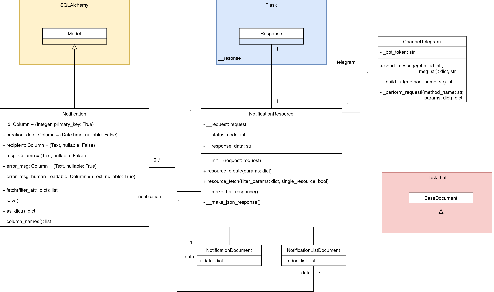

TODO: TOC

# Telegram Notification Service

This web service is able to send messages via the messenger [Telegram](https://telegram.org/).

Telegram provides a [Bot API](https://core.telegram.org/bots/api) which is used

For being able to receive messages from a bot in Telegram a user has to start the initial communication by searching for the bot's username and entering the `/start` command into the chat.

Relevant API calls for sending messages are implemented by this service.

Persistence of `notification` objects is realized by using a SQLite database file.

## API

A RESTful API is implemented which provides some endpoints and is responsible for managing `notification` resources.
It was designed to be used by a rather non-human client. Therefore, supported response content types are "plain" JSON and [JSON Hypertext Application Language](https://tools.ietf.org/html/draft-kelly-json-hal-08).

### Endpoints

Three endpoints are provided:

* `GET /notification` is used to list all `notification` resources. Optionally a query parameter `recipient` can be issued to filter `notifications` of a specific recipient.
* `POST /notification` is the endpoint for creating `notification` objects. Required parameters are `recipient` and the actual message (`msg`) to be sent. If no error happened, Telegram was able to deliver the message to the desired chat identified by `recipient`. 
* `GET /notification/{id}` lists exactly one `notification` object. It requires the specification of an existing `notification` by its `id`.

Please consult the [API documentation deployed via Swagger](https://185.128.119.135/swagger/?urls.primaryName=Telegram%20Notification%20Service) to test it out and to get more information.

### Notification Resource

`notifications` basically represent the state of a message which should have been sent via the Telegram Bot API to a corresponding user who stays in contact with the Telegram bot.

Attributes:

* id is the unique identifier of notifications.
* recipient represents a Telegram channel id.
* message (`msg`) specifies the actual text which has to be sent to the recipient.
* creation date (`creation_date`) defines the date and time of when a `notification` object was created (using UTC time zone). 
* error message (`error_msg`) maintains a very concrete state about success or failure of sending a message. The field `request_error` defines possible error messages which could happen on communicating with the Telegram bot api servers. `status_code` is the http status code of such a request. The last field is the [`telegram_response` resource](https://core.telegram.org/bots/api#making-requests) which contains the exact response of the Telegram api servers.
* human-readable error message (`error_msg_human_readable`) represents an error message if something went wrong in the process talking to the Telegram bot api servers. It has the nature that it contains some user-understandable error message. E.g., `chat not found` if the `recipient` field doesn't contain a valid Telegram channel identifier.

## Application Insights

The web service is written in Python 3 by using the [Flask](https://flask.palletsprojects.com/en/1.1.x/) web framework.
In order to provide data persistence across application restarts the database toolkit [SQLAlchemy](https://docs.sqlalchemy.org/en/13/) was chosen.
The database model has exactly the same fields which are part of the `notification` resource.



The class diagram shows the relation of used classes. Colored boxes indicate external Python packages.
The class `NotificationResource` is the center of attention. It glues everything together and is responsible for building the actual HTTP request data and response code. The response content can be represented as either JSON or JSON HAL. This is decided by the content-types which are supported by the requesting HTTP client. If both JSON and JSON HAL are supported JSON HAL is the preferred content type.
`flak_hal` is a external dependency used for creating such JSON HAL documents which are more self descriptive than plain JSON. One reason for that is the provided `_links` attribute pointing to the resource path itself.
To the left there is the `notification` database model with its fields. Upon request of the HTTP clients using the web service they are either fetched from the database file or created and written into it.
The `ChannelTelegram` class is needed to interact with the Telegram Bot API. There is currently only one method of this API implemented which is called `sendMessage`. The name explains its responsibility.


Another external dependency is called `telegram`. It is an implementation of the Telegram Bot API and capable of reacting to a message a Telegram user sends to the bot.
The purpose of `TelegramResponder` is to answer of incoming messages a user sends to the bot. The most important one is the `/start` message (`WELCOME_MESSAGE`). It is sent automatically after the user started to chat with the bot because the response message contains the unique chat id of the conversation. This id (`recipient`) is needed for being able to send messages to the user via this chat.
The second and last type of messages a bot is able to answer to are all other messages a user sends (`UNKNOWN_MESSAGE`). Since the bot doesn't expect input different from `/start` it will answer which indicates that (e.g., `I was not able to understand you.`).

In addition, there are some pre-defined templating variables maintaining information about the current user who is
chatting with the bot available. These are `USER_FIRST_NAME`, `USER_LAST_NAME`, `USER_FULL_NAME`, `USER_USERNAME` and
`USER_CHAT_ID`.
These variables can be included into the `WELCOME_MESSAGE` and `UNKNOWN_MESSAGE` message environment variable strings to let the responses appear being more personalized to the user.

One last important dependency the `TelegramResponder` class has is `jinja2`. [Jinja2 templating engine](https://jinja2docs.readthedocs.io/en/stable/) is used for enabling the operator to define custom messages for these two kinds a bot has to respond with. They can be set via environment variables passed to the application.

## (TODO: move to global deployment section!!) Deployment

The composition of web services is deployed using Docker and Docker Compose. Since the produced container images are in [OCI](https://opencontainers.org/)-compliant format, it should also be possible to use other container runtimes than Docker.
However, it was not tested during the development process.

In order to deploy all web services at once a unified Docker Compose file was created to simplify this process.

Moreover, since the services are communicating with each other by using their container names as hostnames it was required to do so.
This helps to make the setup more robust against configuration issues (like using wrong container ip addresses).
Docker performs the dns resolution task to provide the actual ip addresses of the services.
All web service containers are running in the same (Docker) network. Therefore, using plain HTTP communication between the services shouldn't be a security concern.

In order to keep credentials out of the Docker Compose file a file named `.env` was created.
It is responsible for defining some environment variables which are needed by the Docker Compose file to set environment information of the web service containers (e.g., like credentials to perform authorization or the Telegram bot token).

Each service provides a unique endpoint. Therefore, the NGINX reverse proxy is able to distinguish to which web service a request has to be forwarded.
To enforce a strict HTTPS-only policy each request reaching the reverse proxy via HTTP is redirected to HTTPS.

The group made the decision to persist the database file of each service. This helps keeping the application working as expected after restarts of the cloud server. Persistence is also realized via Docker by mounting a volume into each service.

## Authorization

The web service uses [OAuth 2.0](https://tools.ietf.org/html/rfc6749) authorization via the provider [Auth0](https://auth0.com).
This helps to prevent the service for being misused by unauthorized parties.

Detailed information about the client credentials flow can be found [here](https://auth0.com/docs/flows/call-your-api-using-the-client-credentials-flow).

The token can be obtained and saved into the variable `AUTH_TOKEN` by executing the following request:
> **Note:**
> Make sure you have both packages `curl` and the json parser `jq` installed on your system.

```bash
$ CLIENT_SECRET=ePj-KKbucEzYGouQLcL2IEMhbDQdGdSHoqEMeeglkJnew1cQtf9R8RdtptslbFY-
$ CLIENT_ID=NnXUyl2Gnf2WG2RwK137aU4EsM93qm4U
$ AUDIENCE=https://185.128.119.135/notification

$ AUTH_TOKEN=$(curl --request POST --url https://scc2020g8.eu.auth0.com/oauth/token \
                    --header 'content-type: application/json' \
                    --data "{\"client_id\":\"${CLIENT_ID}\", \
                             \"client_secret\":\"${CLIENT_SECRET}\", \
                             \"audience\":\"${AUDIENCE}\", \
                             \"grant_type\":\"client_credentials\"}" | jq -r .access_token)
```

Now you should be able to do requests:

```bash
$ curl localhost/notification -H "Accept: application/hal+json" -H "Authorization: Bearer ${AUTH_TOKEN}"
```

## Testing

[Postman](https://www.postman.com/) is used for performing endpoint tests. The source dir contains a Postman collection which can be imported by Postman.

All three endpoints are covered including tests for comparing HTTP response codes and of course also the content of the responses.

There are four kinds of tests which are performed:

* Since this web service supports both plain JSON and JSON HAL response content types they are also covered. For example, it is checked whether the `self` attribute of a resource matches its real url.
* The authorization implementation is covered, too. This is done by comparing response code and content of requests where no (or a malformed) bearer token is set in `Authorization` header.
* Single resources can be fetched by the endpoint `GET /notification/{id}`. It is asserted that the application responses accordingly with a `404` error code and doesn't show unexpected behaviour like a crash.
* The last class of tests implement requests which don't provide required attributes (`recipient` and `msg`).

## Known Limitations of the Telegram Notification Service

* The SQLite database driver doesn't support many requests at the same time and might slow down the entire application at peak loads.
* The same applies to the integrated Flask development server.
* Currently, it is not supported to delete `notifications`. Therefore, the database Docker volume has to be deleted from time to time.
* The endpoint `GET /notification` doesn't support a limitation of found `notification` objects. This might result in big response content.
* The application runs as root inside the Docker container. If an attacker is successful with performing remote code executions, she or he is able to gain root access inside the container.

## Appendix
### Telegram Notification Service
#### OpenAPI Documentation

```yaml
openapi: "3.0.0"
info:
  description: "SCC WS2020 Group8"
  version: "1.1.0"
  title: "Telegram Notification Service API"
servers:
  - url: http://127.0.0.1
security:
  - bearerAuth: []
paths:
  /notification:
    get:
      tags:
      - "notification"
      summary: "List all notifications"
      parameters:
      - in: query
        name: "recipient"
        description: "Name of the recipient to list messages from."
        schema:
          type: string
        required: false
      responses:
        200:
          description: "Return found notifications in a list."
          content:
            application/json:
              schema:
                type: "array"
                items:
                  $ref: '#/components/schemas/Notification'
            application/hal+json:
              schema:
                  type: object
                  required:
                  - "id"
                  - "creation_date"
                  - "recipient"
                  - "msg"
                  properties:
                    _links:
                      type: "object"
                      readOnly: true
                      description: Link relations following the HAL schema
                      properties:
                        self:
                          type: "object"
                          properties:
                            href:
                              type: "string"
                              example: "/notification"
                    _embedded:
                      type: "object"
                      description: "Embedded resources following the HAL schema"
                      properties:
                        notifications:
                          description: "List of all notifications"
                          type: "array"
                          items:
                            type: "object"
                            properties:
                              id:
                                type: "integer"
                                example: 12
                              creation_date:
                                type: "string"
                                example: "2020-12-02 20:49:36.653"
                                description: "DateTime string in UTC time format."
                              recipient:
                                type: "string"
                                example: "0123456789"
                                description: "Telegram chat id"
                              msg:
                                type: "string"
                                example: "This is a message."
                                description: "Message to send to recipient."
                              error_msg:
                                type: "string"
                                format: "json"
                                example: '{"request_error": null, "status_code": 200, "telegram_response": {"ok": true, "result": {"message_id": 188, "from": {"id": 1408066607, "is_bot": true, "first_name": "bot_first_name", "username": "botusername"}, "chat": {"id": 12345678, "first_name": "Max", "username": "MaxMustermann", "type": "private"}, "date": 1606942176, "text": "This is a new message."}}}'
                                description: "JSON response containing of three objects: `request_error`,
                                `status_code` and `telegram_response`.
                                `request_error` contains
                                information if network error occurred while contacting Telegram API.
                                `status_code` is the HTTP status code returned by Telegram API.
                                `telegram_response` is a
                                [response object](https://core.telegram.org/bots/api#making-requests)
                                generated by Telegram API."
                              error_msg_human_readable:
                                type: "string"
                                enum:
                                 - Connection error
                                 - General network error
                                 - Unknown error
                                description: "Contains human readable error message if something went
                                wrong during sending message to Telegram API."
        401:
          description: Unauthorized
          content:
            application/json:
              schema:
                $ref: '#/components/schemas/Error'
        404:
          description: "Couldn't find notifications of specified recipient."
    post:
      tags:
      - "notification"
      summary: "Add new notification"
      requestBody:
        required: true
        content:
          application/x-www-form-urlencoded:
            schema:
              type: object
              properties:
                recipient:
                  description: "Name of the recipient to send a message to."
                  type: "string"
                msg:
                  description: "Message to send."
                  type: "string"
              required:
               - recipient
               - msg
      responses:
        201:
          description: "Notification was created. Nevertheless, this doesn't necessarily mean that the message was successfully sent to Telegram."
          content:
            application/json:
              schema:
                $ref: '#/components/schemas/Notification'
            application/hal+json:
              schema:
                type: "object"
                required:
                - "id"
                - "creation_date"
                - "recipient"
                - "msg"
                properties:
                  _links:
                    type: "object"
                    readOnly: true
                    description: Link relations following the HAL schema
                    properties:
                      self:
                        type: "object"
                        properties:
                          href:
                            type: "string"
                            example: "/notification/12"
                  id:
                    type: "integer"
                    example: 12
                  creation_date:
                    type: "string"
                    example: "2020-12-02 20:49:36.653"
                    description: "DateTime string in UTC time format."
                  recipient:
                    type: "string"
                    example: "0123456789"
                    description: "Telegram chat id"
                  msg:
                    type: "string"
                    example: "This is a message."
                    description: "Message to send to recipient."
                  error_msg:
                    type: "string"
                    format: "json"
                    example: '{"request_error": null, "status_code": 200, "telegram_response": {"ok": true, "result": {"message_id": 188, "from": {"id": 1408066607, "is_bot": true, "first_name": "bot_first_name", "username": "botusername"}, "chat": {"id": 12345678, "first_name": "Max", "username": "MaxMustermann", "type": "private"}, "date": 1606942176, "text": "This is a new message."}}}'
                    description: "JSON response containing of three objects: `request_error`,
                    `status_code` and `telegram_response`.
                    `request_error` contains
                    information if network error occurred while contacting Telegram API.
                    `status_code` is the HTTP status code returned by Telegram API.
                    `telegram_response` is a
                    [response object](https://core.telegram.org/bots/api#making-requests)
                    generated by Telegram API."
                  error_msg_human_readable:
                    type: "string"
                    enum:
                     - Connection error
                     - General network error
                     - Unknown error
                    description: "Contains human readable error message if something went
                    wrong during sending message to Telegram API."
        400:
          description: "A required argument is missing."
          content:
            application/json:
              schema:
                $ref: '#/components/schemas/Error'
        401:
          description: Unauthorized
          content:
            application/json:
              schema:
                $ref: '#/components/schemas/Error'
  /notification/{notification_id}:
    get:
      tags:
      - "notification"
      summary: "Get notification by id"
      parameters:
      - in: "path"
        name: "notification_id"
        description: "Notification id."
        required: true
        schema:
          type: integer
          minimum: 0
      responses:
        200:
          description: "Found notification with specified id."
          content:
            application/json:
              schema:
                $ref: '#/components/schemas/Notification'
            application/hal+json:
              schema:
                type: "object"
                required:
                - "id"
                - "creation_date"
                - "recipient"
                - "msg"
                properties:
                  _links:
                    type: "object"
                    readOnly: true
                    description: Link relations following the HAL schema
                    properties:
                      self:
                        type: "object"
                        properties:
                          href:
                            type: "string"
                            example: "/notification/12"
                  id:
                    type: "integer"
                    example: 12
                  creation_date:
                    type: "string"
                    example: "2020-12-02 20:49:36.653"
                    description: "DateTime string in UTC time format."
                  recipient:
                    type: "string"
                    example: "0123456789"
                    description: "Telegram chat id"
                  msg:
                    type: "string"
                    example: "This is a message."
                    description: "Message to send to recipient."
                  error_msg:
                    type: "string"
                    format: "json"
                    example: '{"request_error": null, "status_code": 200, "telegram_response": {"ok": true, "result": {"message_id": 188, "from": {"id": 1408066607, "is_bot": true, "first_name": "bot_first_name", "username": "botusername"}, "chat": {"id": 12345678, "first_name": "Max", "username": "MaxMustermann", "type": "private"}, "date": 1606942176, "text": "This is a new message."}}}'
                    description: "JSON response containing of three objects: `request_error`,
                    `status_code` and `telegram_response`.
                    `request_error` contains
                    information if network error occurred while contacting Telegram API.
                    `status_code` is the HTTP status code returned by Telegram API.
                    `telegram_response` is a
                    [response object](https://core.telegram.org/bots/api#making-requests)
                    generated by Telegram API."
                  error_msg_human_readable:
                    type: "string"
                    enum:
                     - Connection error
                     - General network error
                     - Unknown error
                    description: "Contains human readable error message if something went
                    wrong during sending message to Telegram API."
        401:
          description: Unauthorized
          content:
            application/json:
              schema:
                $ref: '#/components/schemas/Error'
        404:
          description: "Couldn't find notifications with specified id."
components:
  securitySchemes:
    bearerAuth:
      type: http
      scheme: bearer
      bearerFormat: JWT
  schemas:
    Notification:
      type: "object"
      required:
      - "id"
      - "creation_date"
      - "recipient"
      - "msg"
      properties:
        id:
          type: "integer"
          example: 12
        creation_date:
          type: "string"
          example: "2020-12-02 20:49:36.653"
          description: "DateTime string in UTC time format."
        recipient:
          type: "string"
          example: "0123456789"
          description: "Telegram chat id"
        msg:
          type: "string"
          example: "This is a message."
          description: "Message to send to recipient."
        error_msg:
          type: "string"
          format: "json"
          example: '{"request_error": null, "status_code": 200, "telegram_response": {"ok": true, "result": {"message_id": 188, "from": {"id": 1408066607, "is_bot": true, "first_name": "bot_first_name", "username": "botusername"}, "chat": {"id": 12345678, "first_name": "Max", "username": "MaxMustermann", "type": "private"}, "date": 1606942176, "text": "This is a new message."}}}'
          description: "JSON response containing of three objects: `request_error`,
          `status_code` and `telegram_response`.
          `request_error` contains
          information if network error occurred while contacting Telegram API.
          `status_code` is the HTTP status code returned by Telegram API.
          `telegram_response` is a
          [response object](https://core.telegram.org/bots/api#making-requests)
          generated by Telegram API."
        error_msg_human_readable:
          type: "string"
          enum:
           - Connection error
           - General network error
           - Unknown error
          description: "Contains human readable error message if something went
          wrong during sending message to Telegram API."
    Error:
      type: "object"
      properties:
        code:
          type: "string"
          description: "Error message"
          example: "authorization_header_missing"
        description:
          type: "string"
          description: "More concrete error description"
          example: "Authorization header is expected"
```